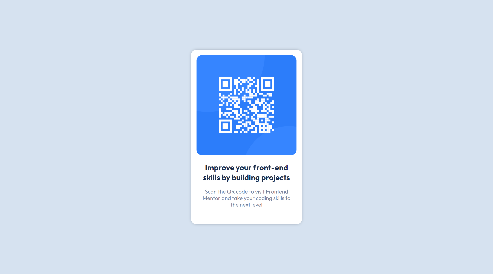
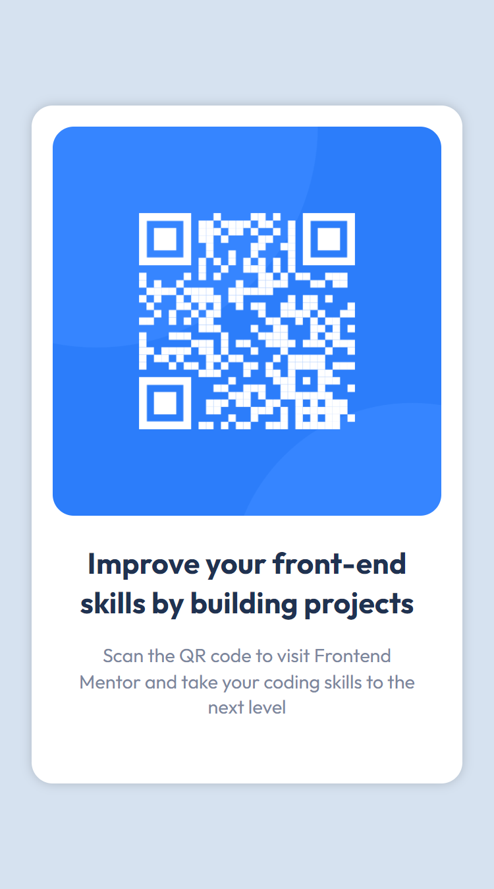

# Frontend Mentor - QR code component

## Welcome! 👋

This is a solution to the **QR code component challenge on Frontend Mentor** and the third challenge I complete.

For this solution I took the suggestions from the previous challenge and made it responsive for the other widths besides 1440px and 375px.

Only use **HTML** and **CSS**.

## Screenshots 🤨📷

### 1440px - Desktop

### 375px - Mobile

